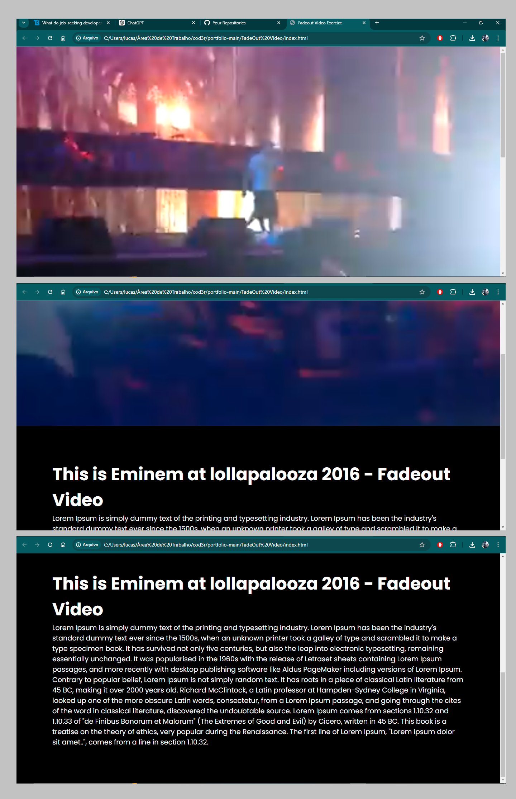

# Eminem FadeOut Video

Este é um projeto simples que fiz para demonstrar uma transição simples de FrontEnd para diversas aplicações.

## Tecnologias Utilizadas

- JavaScript
- HTML
- CSS

## Funcionalidades

- [x] Deslizar a tela permitindo que o video no background suma em um fade

## Como Usar

1. Clone o repositório.
2. Abra o arquivo `index.html` no seu navegador.

## Contribuição

Contribuições são bem-vindas! Abra uma issue para discutir o que você gostaria de mudar.
