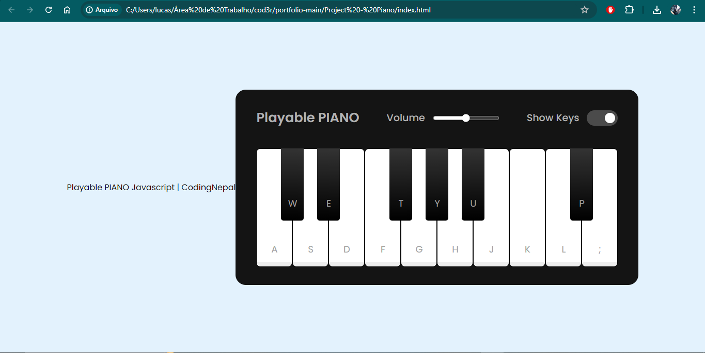

# JavaScript Piano

Este é um projeto simples que fiz seguindo um tutorial para aprender funções básicas de JavaScript.

## Tecnologias Utilizadas

- JavaScript
- HTML
- CSS

## Funcionalidades

- [ ] apresentar as teclas
- [ ] atribuir notas a cada tecla
- [ ] regular volume
- [ ] ativar e desativar "legenda de piano"

## Como Usar

1. Clone o repositório.
2. Abra o arquivo `index.html` no seu navegador.

## Contribuição

Contribuições são bem-vindas! Abra uma issue para discutir o que você gostaria de mudar.
