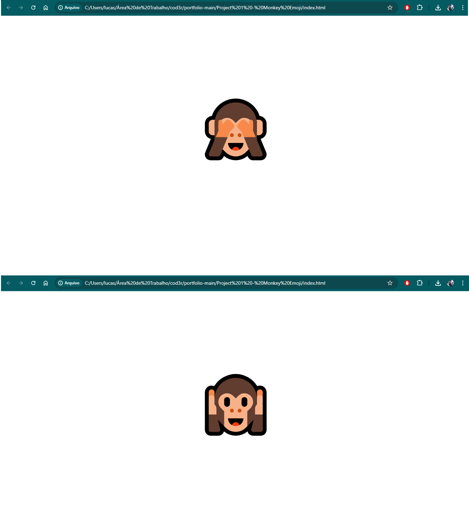

# Monkey Emoji

Este é um projeto simples que fiz para demonstrar uma transição simples com clique para diversas aplicações.

## Tecnologias Utilizadas

- JavaScript
- HTML
- CSS

## Funcionalidades

- [ ] Trocar o emoji ao clique

## Como Usar

1. Clone o repositório.
2. Abra o arquivo `index.html` no seu navegador.

## Contribuição

Contribuições são bem-vindas! Abra uma issue para discutir o que você gostaria de mudar.
