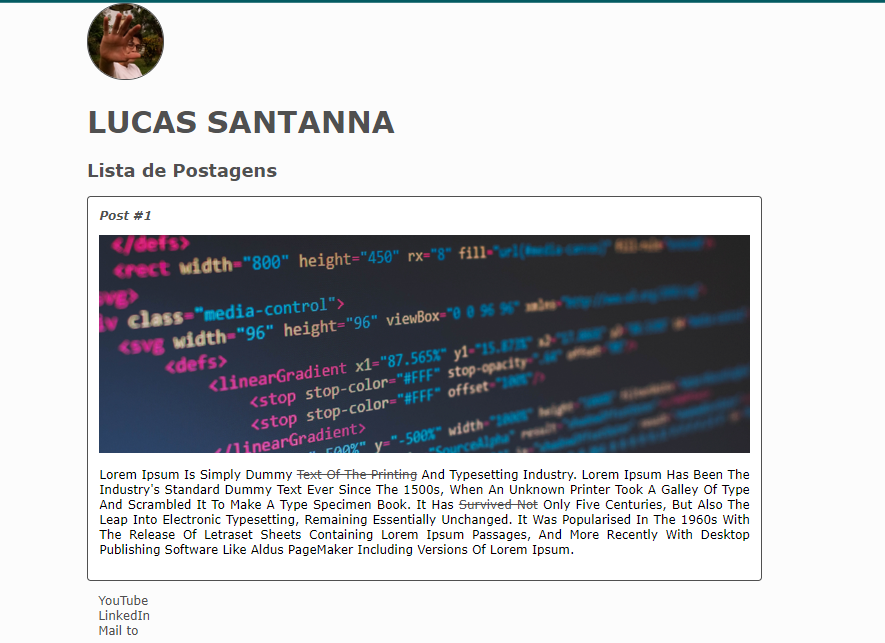

# HTML

Este é um projeto simples que fiz para demonstrar funções simples de FrontEnd.

## Tecnologias Utilizadas

- JavaScript
- HTML
- CSS

## Funcionalidades

- [ ] Exibir avatar
- [ ] Exibir Postagens e Listas de postagem, com imagem
- [ ] Apresentar links para acesso a outras plataformas: Youtube, LinkedIn, E-mail

## Como Usar

1. Clone o repositório.
2. Abra o arquivo `index.html` no seu navegador.

## Contribuição

Contribuições são bem-vindas! Abra uma issue para discutir o que você gostaria de mudar.
